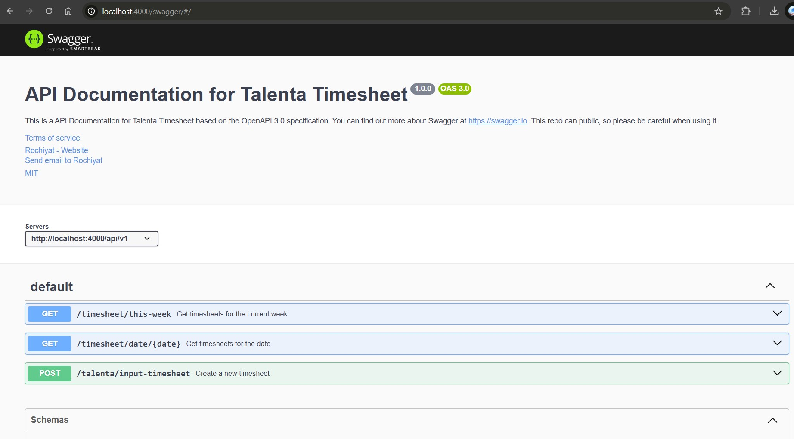

# Talenta Timesheet

Talenta Timesheet is a project initiated by our team to simplify the process of inputting timesheets into the Talenta platform. This tool helps employees log their working hours efficiently and accurately.

## How to Run Development

```bash
git clone https://github.com/rochiyat/talenta-timesheet.git or git clone https://[token-github]@github.com/rochiyat/talenta-timesheet.git
npm install && npm run dev
```

## How to Run Production

```bash
npm install && npm run build && npm run start
```

## How to Run Tests

```bash
npm run test
```

## How to Run Unit Tests

```bash
npm run test ./test/unit/services/timesheet.service.test.ts
```

## How to Run Test Coverage

```bash
npm run test:coverage
```

## How to Run Test Coverage for a Specific File

```bash
npm run test ./test/unit/services/timesheet.service.test.ts -- --coverage
```

## Swagger Documentation

Swagger documentation is available at [http://localhost:3000/swagger](http://localhost:3000/swagger)
Execute several application endpoints using Swagger UI.


Swagger UI


## Contributing

Please read [CONTRIBUTING.md](./CONTRIBUTING.md) for details on our code of conduct.

## Authors

- [Github](https://github.com/rochiyat)
- [LinkedIn](https://www.linkedin.com/in/rochiyat)

## License

This project is licensed under the MIT License - see the [LICENSE.md](./LICENSE.md) file for details.

